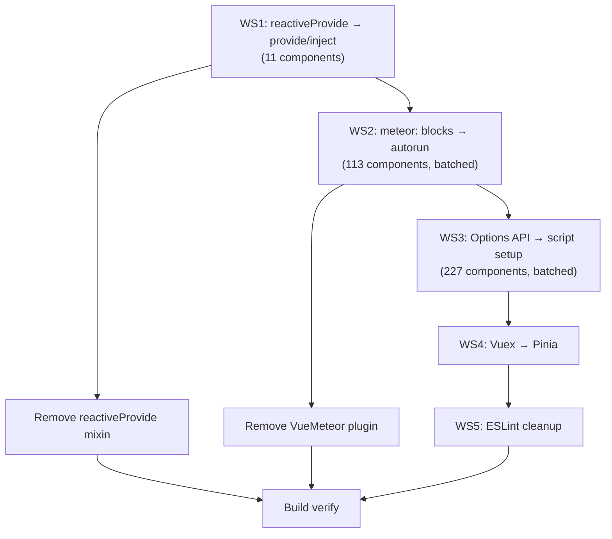

# DiceCloud Migration — Phase 2: Options API → Composition API + Pinia + Code Hardening

## Background

The DiceCloud app has **successfully completed Phase 1** of the Meteor v3 + Vue 3 + Vuetify 3 migration:
- ✅ Meteor 3.5.2, Vue 3.5.43, Vuetify 3.13.4, Vue Router 4
- ✅ Bundler: Meteor's Rspack integration (`rspack@1.3.0`); meteor-vite and Vite are gone (WS7)
- ✅ State: Pinia only; Vuex and the `$store` shim are gone (WS4)
- ✅ Components: all 341 on `<script setup>`; no Options API, no mixins (WS3)
- ✅ All server-side async refactoring (`*Async()` methods, async `run()`)
- ✅ All client-side `Meteor.call()` → `callAsync()` conversion
- ✅ Vuetify 3 template overhaul across ~344 components
- ✅ Build and dev server operational

**Phase 2** (this plan) addresses the remaining migration debt:
- Convert **all 340 Options API components** to **Composition API (`<script setup>`)**
- Replace `meteor: {}` reactivity bridge with `autorun()`/`subscribe()` composables
- Eliminate the `reactiveProvide` shim
- Migrate **Vuex → Pinia**
- ESLint/code quality cleanup

**Decisions (user-approved):**
- ✅ Migrate Vuex → Pinia
- ✅ Full coverage (all 340 components)
- ✅ Verify after each batch, update this plan at each step

---

## Work Streams & Execution Order



---

### WS1: `reactiveProvide` → Native `provide()`/`inject()` (11 components) — STATUS: ✅ COMPLETE

Converted these 11 components to `<script setup>` with native `provide()`:

| # | Component | Status |
|---|-----------|--------|
| 1 | `creature/character/CharacterSheet.vue` | ✅ |
| 2 | `creature/character/printedCharacterSheet/CharacterSheetPrinted.vue` | ✅ |
| 3 | `creature/character/CreatureRootDialog.vue` | ✅ |
| 4 | `creature/creatureProperties/CreaturePropertyDialog.vue` | ✅ |
| 5 | `creature/slots/LevelUpDialog.vue` | ✅ |
| 6 | `creature/slots/SlotFillDialog.vue` | ✅ |
| 7 | `tabletop/TabletopComponent.vue` | ✅ |
| 8 | `tabletop/CreatureFromLibraryDialog.vue` | ✅ |
| 9 | `properties/components/spells/CastSpellWithSlotDialog.vue` | ✅ |
| 10 | `properties/InsertPropertyDialog.vue` | ✅ |
| 11 | `library/LibraryNodeDialog.vue` | ✅ |
| 12 | Remove `installReactiveProvide(app)` from `vueSetup.js` | ✅ |
| 13 | Delete `reactiveProvide.js` | ✅ |

---

### WS2: `meteor: {}` Block → `autorun()` / `subscribe()` (113 components) — STATUS: ✅ COMPLETE

Batched by domain:

| Batch | Domain Area | Count | Status |
|-------|-------------|-------|--------|
| 2A | Creature & Character | ~40 | ✅ |
| 2B | Properties & Forms | ~30 | ✅ |
| 2C | Library | ~15 | ✅ |
| 2D | Tabletop | ~10 | ✅ |
| 2E | Pages, User, Sharing, Files, DialogStack | ~18 | ✅ |

---

### WS3: Remaining Options API → `<script setup>` — STATUS: ✅ COMPLETE (341 of 341 on `<script setup>`; no Options API left)

Converted with an AST transform (`vue-eslint-parser`) that inlines the three shared
mixins and refuses anything it cannot convert safely; the 17 it refused were then
converted by hand (2026-09-24, see below). The three mixins (`propertyViewerMixin`,
`propertyFormMixin`, `treeNodeViewMixin`) are inlined as literal props, a `change()`
emitter and a `title` computed. All five Vue mixin files are now deleted
(`propertyViewerMixin`, `propertyFormMixin`, `treeNodeViewMixin`, `schemaFormMixin`,
`SmartInputMixin`). `LaunchCountdown.vue` was deleted rather than converted (see WS8).

| Batch | Directory | Converted | Status |
|-------|-----------|-----------|--------|
| 3A | `components/` (reusable widgets, global) | ~50 | ✅ |
| 3B | `creature/` | 67 | ✅ |
| 3C | `properties/` | 143 | ✅ (8 by hand) |
| 3D | `dialogStack/`, `layouts/`, `icons/` | 10 | ✅ (DialogStack by hand) |
| 3E | `library/`, `tabletop/` | 39 | ✅ |
| 3F | `pages/`, `user/`, `sharing/`, `files/`, `log/`, `docs/` | 49 | ✅ (6 by hand; LaunchCountdown deleted) |

What the transform refuses, and why each refusal is a real hazard:

| Guard | Reason |
|-------|--------|
| `$refs`, `$el`, `$parent`, `$options` | No component instance in `<script setup>`; each needs template refs designed by hand |
| A binding that shadows an import | `methods: { doAction }` beside `import doAction` becomes one binding — the component would call itself |
| An unresolvable `this.x` | Options API returns `undefined` for an unknown `this.x`; a bare identifier throws. Two such latent bugs were found this way |
| Spread `components:` | The registered names are not statically known, so the template would silently lose them |
| `data()` with statements | Needs judgement about what becomes a `ref` and what is setup code |

The 17 the transform refused, converted by hand (2026-09-24):

| Component | What the conversion needed |
|-----------|----------------------------|
| `dialogStack/DialogStack.vue` | `:is` received kebab-case names resolved through `components: { ...DialogComponentIndex }`; `<script setup>` has no registry, so `resolveDialog()` maps them onto the index (all 34 names pushed in the client verified). `$refs[i][0].$el` → a DOM query on each dialog's `data-index`. **The page-scroll lock behind dialogs had been dead since Vue 3** (see below) |
| `pages/SignIn.vue`, `pages/Register.vue`, `pages/ResetPassword.vue` | Template ref `form`; **Vuetify 3's `validate()` is async** (see below) |
| `properties/treeNodeViews/TreeNodeView.vue` | The spread registration was unnecessary: `:is` already receives the component object |
| `properties/shared/PropertySelector.vue` | `data: { PROPERTIES }` only re-exposed the import to the template |
| `properties/viewers/ActionViewer.vue` | Its `doAction()` method shadowed the imported `doAction` → import aliased `doActionApi`. Dropped `rollBonusTooLong` (read an undeclared `this.rollBonus`) and `actionTypeIcon`, neither used by the template |
| `properties/forms/ReferenceForm.vue` | Its `updateReferenceNode()` shadowed the imported method → import aliased `updateReferenceNodeMethod` |
| `properties/forms/TriggerForm.vue` | `data.eventOptions` etc. shadowed the imported maps → imports aliased `EVENT_OPTIONS`…; dead extra-tags code removed (the template delegates to `<tag-targeting>`) |
| `properties/forms/DamageMultiplierForm.vue` | `data: { DAMAGE_TYPES }` re-exposed the import; kept the `@update:error="error"` handler |
| `properties/forms/ClassForm.vue`, `SlotForm.vue` | `data()` built `slotTypes` with a loop → plain consts; ClassForm's extra-tags code and unused `slotTypes` were dead |
| `properties/forms/AttributeForm.vue` | `data()` post-processed `attributeTypeHints` → `Object.fromEntries`; path watcher `'model.attributeType'` → getter `watch` |
| `pages/FunctionReference.vue` | The `functions` computed shadowed the imported `functions` → import aliased `parserFunctions` |
| `docs/DocEditForm.vue` | **Three pre-existing bugs** (same code in the Vue 2 baseline): the template calls `remove()` with no argument while it destructured `{ ack }`, so deleting a doc from this form always threw; it tested `doc.parent`, which no doc has (docs store `parentId`), so a deleted child always returned to `/docs`; `pull()` read `this.model`, which does not exist — `pull`/`push` were unused by the template and are removed |
| `properties/components/attributes/HealthBarProgress.vue` | `this.$vuetify.theme` → `useTheme()` |

Bugs these conversions exposed (all verified fixed in the browser; the scroll lock was
also reproduced there before the fix, the validation bug was established from
Vuetify's source):

| Bug | Evidence | Fix |
|-----|----------|-----|
| The page behind an open dialog kept scrolling. The stack's `watch: { dialogs }` never fired: the Pinia store mutates the array in place (`push`/`pop`), and **in Vue 3 a watcher on an array only fires when the array is replaced** (Vue 3 migration guide, "Watch on Arrays") | Probe, page overflowing, dialog open: `html.lock-scroll` absent before, present after; released when the dialog closes | Watch `dialogs.length`; the delayed unlock also re-checks that no dialog opened meanwhile |
| Sign-in, register and reset-password submitted **invalid** forms. `if (form.validate())` tested a Promise, always truthy — Vuetify 3's `validate()` is `async` and resolves to `{ valid, errors }` (verified in `vuetify/lib/composables/form.js`) | Probe on `/sign-in` with `Meteor.loginWithPassword` stubbed: empty submit → 0 calls and both "required" messages; filled → 1 call | `const { valid } = await form.value.validate()` |
| 6 property edit forms rendered without their calculated fields and sections: `AdjustmentForm`, `AttributeConsumedForm`, `EffectForm`, `PointBuyForm`, `ProficiencyForm`, `SavingThrowForm` lost the `ComputedField`/`FormSection`/`FormSections` registrations `propertyFormMixin` used to provide when they were converted | Template audit across all components; the flow only ever opened the attribute form | Imports restored. The audit now resolves every custom tag in every component (comments and attribute text excluded): **0 unresolved** |
| `TreeSearchInput.vue` passed the filter count to `VBadge`'s Boolean `modelValue` | Console warning on a library page, first seen once the test account had a library | `:model-value="!!numFilters"` |

Fixes the conversion itself surfaced (each was invisible while the component was
Options API, because unused computed properties and dead options are not linted):

- `AttributeCard.vue`, `SpellListTile.vue`: `$attrs` read from script code, which only works in a template → `useAttrs()`
- `ResourceCardContent.vue`: `watch: { 'model.value'() {} }` — a string path watcher, now `watch(() => props.model.value, …)`
- `ProficiencySelect.vue`: a module-scope `const ICON_SPIN_DURATION` the options referred to
- `FormSection.vue` re-exported `FormSections`, which `<script setup>` cannot do; its 21 importers now import `FormSections` from its own module
- ~45 dead computeds, methods and imports removed once lint could see them

### WS4: Vuex → Pinia — STATUS: ✅ COMPLETE

Migrated in two stages: first a Pinia-backed Proxy shim so 100+ components kept
working, then (2026-09-23) every call site moved onto the stores directly and the
shim was deleted. No `vuex` package, alias, or `$store` remains.

| Step | Task | Status |
|------|------|--------|
| 1 | Install `pinia` | ✅ |
| 2 | Audit `vuexStore.js` — map state, mutations, actions | ✅ |
| 3 | Create Pinia stores (`useAppStore`, `useDialogStackStore`) | ✅ |
| 4 | Intercept `$store` via `vuexStoreProxy.js` adapter and alias | ✅ |
| 5 | Verify build | ✅ |
| 6 | Rewrite 110 components + `useTabFolders.js` + `doAction.ts` onto the stores (`commit`/`dispatch`/`state`/`getters` → actions and state) | ✅ |
| 7 | Delete `vuexStoreProxy.js`, the `vuex` + `/imports/client/ui/vuexStore` aliases in `vite.config.mjs`, and the `vuex` dependency | ✅ |
| 8 | `doAction({ $store, … })` no longer takes a store; it resolves `useDialogStackStore()` itself (16 call sites updated) | ✅ |
| 9 | `FormSections.vue` read a store getter from `data()`, which runs before computed properties — converted to `<script setup>` | ✅ |

---

### WS5: Cleanup — STATUS: ✅ COMPLETE

| Task | Status |
|------|--------|
| Remove unused `VueMeteor` import from `vueSetup.js` | ✅ |
| Declare emitted events (`emits`) across 67 components | ✅ |
| ESLint formatting autofix (indent, attribute order, component order) | ✅ |
| Delete stray `imports/client/ui/scratch.vue` (invalid syntax) | ✅ |
| Lint debt: **256 errors → 0** (7 warnings left, all `vue/prop-name-casing` on the `_id` prop the dialog stack passes as data) | ✅ |
| `vuex` alias to the Pinia proxy in `vite.config.mjs` — removed along with the proxy and the dependency (see WS4) | ✅ |

How the lint debt was cleared (2026-09-23):

| Rule | Count | Resolution |
|------|-------|------------|
| `@typescript-eslint/no-unused-vars` | 185 | Removed dead bindings with an AST pass (`vue-eslint-parser`), keeping calls that do something beyond producing a value (`subscribe`, `defineProps`, `defineEmits`); `catch (e)` → `catch`; unused params dropped |
| `no-undef` + `no-useless-escape` in `imports/parser/grammar.js` | 20 | `.eslintignore`: the file is nearley output compiled from `grammar.ne` |
| `vue/multi-word-component-names` | 15 | `Sidebar` → `AppSidebar`, `Breadcrumbs` → `PropertyBreadcrumbs` (both used as tags); rule scoped off for `imports/client/ui/pages/*.vue`, which the router imports by path and nothing renders as a tag |
| `@typescript-eslint/no-require-imports` | 12 | Kept the `require()`s — each loads a module on one side of the wire only — with a reason comment and a targeted disable. `ReferenceTreeNode.vue` instead uses `defineAsyncComponent()` for its circular import |
| `no-unreachable` | 9 | Disabled test suites became `describe.skip` (now reported as 7 pending); `validateDatabase`'s unreachable diagnostics are behind `VALIDATE_DATABASE=1`; the never-implemented `selectedCreatureTemplates` body is now a documented stub |
| `no-unused-expressions`, `no-dupe-keys`, `no-unused-components`, `no-ref-as-operand`, `no-computed-properties-in-data` | 9 | Real defects: a comma-operator typo, a self-referential computed, lodash `debounce` colliding with a `debounce` prop, two dead component registrations |
| `vue/no-side-effects-in-computed-properties` | 2 | `errors` computeds wrote `valid.value`; `valid` is now derived from `errors` |
| `no-empty-object-type`, `no-unsafe-function-type`, `ban-types` | 4 | `@types/*.d.ts`: documented disables where the type has to match the upstream declaration it augments; stale `ban-types` name updated for typescript-eslint 8 |
| Warnings: `order-in-components`, `require-default-prop`, `require-prop-types`, `no-template-shadow`, `no-lone-template` | 73 → 0 | `--fix` for ordering; explicit prop types/defaults; Vuetify activator slots renamed to `{ props: activatorProps }` where they shadowed `defineProps` |

---

### WS6: Migration correctness (2026-09-23) — STATUS: ✅ COMPLETE

The app did not boot and several documented API changes were still outstanding.
All items below were verified in a browser and/or the server test suite.

| # | Fix | Source of truth |
|---|-----|-----------------|
| 1 | `vuexStoreProxy.js` called `useStore()` at module scope, before `app.use(pinia)` — fatal, blank page on every route | Pinia: a store may not be used before its app installs Pinia |
| 2 | `getThemeColor.js` still read `vuetify.framework.theme.themes[...]` — threw in every dialog and toolbar | Vuetify 3 theme instance (`theme.current`) |
| 3 | `subscribe('name', () => [args])` in 25 components sent the callback to the publication as an argument | vue-meteor-tracker 3: `subscribe(() => [name, ...args])` |
| 4 | `sub.ready()` called as a function (16 components), nested `ready`/`result` refs read in templates | `ready`/`result` are `ComputedRef`s; nested refs do not unwrap |
| 5 | `subscriptionData(handle)` was passed the composable object instead of the Meteor handle (`.sub`) | reactive-publish subscription handle |
| 6 | 106 inline handlers used `...arguments`, passing the render context as the field value (corrupted saves, stack overflows) | Vue 3 compiles inline handlers to arrow functions |
| 7 | 193 undeclared emits in 67 components — native DOM events reached parent handlers (`creatureProperties.update` with no `path`) | Vue 3 `emits` option / fallthrough attributes |
| 8 | `<v-layout>`/`<v-flex>` (164 tags, 38 files) and literal `layout`/`flex`/`column` classes (109 lists) | Vuetify 3 removed the v2 grid; flex utilities replace it |
| 9 | `v-list-item-action` (21), v2 stepper components, `dark`/`light` props, `<dir>`, group transitions without `tag` | Vuetify 3 upgrade guide |
| 10 | Vue 3 transition class rename (`*-enter` → `*-enter-from`) in DialogStack and HealthBar | Vue 3 transition classes |
| 11 | Dialog stack: `z-index: 6` under Vuetify 3's layout (1000+), and `.dialog > *` stretched `v-card__loader` over the dialog, swallowing every click | Vuetify 3 layout z-index / VCard structure |
| 12 | `useDisplay()` used non-destructured in 6 components (`display.smAndUp` never unwrapped) | Vuetify 3 `useDisplay` returns refs |
| 13 | Speed dial activator was never bound; v2 positioning props | Vuetify 3 VSpeedDial is menu-based (`location`, activator `props`) |
| 14 | `writeBulkOperations` used a callback with `bulkWrite` — every property insert/move hung forever | MongoDB Node driver 6 dropped callbacks |
| 15 | `recalculateCalculation` passed an async getter to synchronous aggregators — effects and proficiencies silently skipped during actions | — |
| 16 | `await getVariables(id)?.[stat]` precedence — attribute damage never found its stat | — |
| 17 | The app defined schemas with npm `simpl-schema` while collection2 v4 merges per-type schemas with `aldeed:simple-schema`; subschema fields were cleaned away (property icons never saved) | aldeed:collection2 v4 pairing |
| 18 | `meteor test` could not boot (no `Collection2.load()`, custom schema options unregistered); async test fixtures raced | collection2 `static` entry; Meteor eager load order (`lib/`) |
| 19 | Service worker re-registered in development, serving stale/HTML modules (blank routes) | Vite dev serves unhashed module URLs |

---

### WS7: meteor-vite → Meteor's Rspack integration — STATUS: ✅ COMPLETE (2026-09-23)

Meteor 3.4+ ships a first-party Rspack integration, and the official Vue 3 + Meteor 3
tutorial uses it: *"Using the Rspack bundler is the default convention in Meteor 3.4+"*
(docs.meteor.com/tutorials/vue/meteorjs3-vue3, confirmed by scaffolding `meteor create --vue`
with 3.5.2). Rspack bundles the app's own code; Meteor's bundler still produces the final
output, so Atmosphere packages keep working.

| Step | Task | Status |
|------|------|--------|
| 1 | `meteor remove jorgenvatle:vite`, `meteor add rspack` (pulls `rspack@1.3.0` + `tools-core`) | ✅ |
| 2 | npm: drop `meteor-vite`, `vite`, `@vitejs/plugin-vue`, `vite-plugin-vuetify`; add `@meteorjs/rspack`, `@rspack/core`, `@rspack/cli`, `vue-loader`, `@rsdoctor/rspack-plugin`, `@swc/helpers` | ✅ |
| 3 | Delete `vite.config.mjs` and `imports/client/vite-entry.js`; fold the entry back into `client/main.js` (Meteor's own mainModule), drop the injected `_vite-bundle` imports from both entries | ✅ |
| 4 | `rspack.config.js`: `vue-loader` + `VueLoaderPlugin`, native CSS, Vue's `__VUE_*` feature flags | ✅ |
| 5 | `node:assert` in `applyDamageProperty.ts` reached the client bundle — replaced with a `Meteor.Error` throw | ✅ |
| 6 | discord.js → prism-media optional deps (`ffmpeg-static`, `bufferutil`, `utf-8-validate`) marked external on the server | ✅ |
| 7 | `ngraph.graph` (CommonJS) `require()`d `ngraph.events`, which publishes both an ESM and a CommonJS build: Rspack handed it the ESM namespace, so `eventify` arrived as `{ default }` and **every creature recomputation threw server-side**. Aliased to the CommonJS build | ✅ |
| 8 | `meteor test` no longer relies on Meteor's `lib/` load order (Rspack bundles the suites): added `tests/main.js` as `meteor.testModule`, which loads collection2's `static` entry then the suites | ✅ |
| 9 | Stale Vite references in comments reworded; `.gitignore` picked up the reserved build directories automatically | ✅ |

Verification:

| Check | Result |
|-------|--------|
| Dev server | Compiles client + server, no errors |
| 13 routes crawled | 0 console messages |
| Interactive flow (13 steps) | All clean |
| Server log during both | No exceptions |
| `meteor test --once` | 105 passing, 0 failing, 7 pending |
| `meteor build` | Exit 0 — bundle **168 MB, down from 653 MB** under meteor-vite |
| Production CSS asset URLs | `url(/fonts/game-icons.woff)` stays root-absolute, so the Vite `renderBuiltUrl` workaround is gone |

The `eventify` break is the reason the verification loop now also greps the dev
server log: it was invisible to the browser (a server-side exception inside an
async callback) and the route crawl was completely clean while every creature
silently failed to recompute.

Three of the custom Vite plugins are no longer needed: Rspack handles `require()` natively
(the require-interop plugin), keeps `server/` directories out of the client bundle, and
supports top-level await without a build target override.

---

### WS8: Follow-ups (2026-09-24) — STATUS: ✅ COMPLETE

| # | Item | Resolution |
|---|------|------------|
| 1 | `insertPropertyFromLibraryNode` computed `root`/`parentId` and passed them to a helper that never used them — "check the previous commit; remove if meaningless" | **They had a meaning, and the feature was broken.** Before commit `e4590de3` ("Migrated insert prop methods to nested sets"), the copies were re-parented onto the creature by `setLineageOfDocs({ newAncestry })`. That migration replaced the ancestry with `root`/`parentId` but never applied them, so every property inserted from a library kept `root: { collection: 'libraries' }`: it was stored but never appeared on the creature (and its `left` stayed at `MAX_SAFE_INTEGER`). Upstream DiceCloud `develop` still has the same code. Restored: every copy gets the creature as `root`; the top copy gets the target property as `parentId`, or none at the top level (the same convention as `insertProperty`) |
| 2 | Verification of item 1 | Created a library with a folder and a child through the real methods, inserted the folder onto the test creature and the child under the inserted folder. Before: both copies rooted in the library. After: both rooted in the creature, the child under the new folder, the nested insert under its target, all inside the creature's rebuilt nested-set range |
| 3 | `validateDatabase` diagnostics behind `VALIDATE_DATABASE=1` | Approved as is |
| 4 | `LaunchCountdown.vue` (unrouted; counted down to 7 May 2020) | Deleted, with `imports/constants/LAUNCH_DATE.js` and the `@chenfengyuan/vue-countdown` dependency, which nothing else used |
| 5 | ESLint read Rspack's generated `_build/` bundles (≈31,000 errors) and flagged `require()` in `rspack.config.js` | `_build/` and the reserved `build-assets`/`build-chunks` directories added to `.eslintignore`; `no-require-imports` scoped off for `rspack.config.js`, a CommonJS module in the form `meteor create` scaffolds |
| 6 | Content pulled in through a library `reference` node landed at the character's **top level** instead of where the reference was — found while verifying the Vexus import (TODO 2) | Same commit `e4590de3` dropped both steps that placed a reified subtree: the referenced node inheriting the reference's `order`, and `setLineageOfDocs` hanging the subtree under the reference's parent. The referenced node now takes the reference's `parentId` and `left`. Verified with a real Monk level 1 (22 descendants, 3 of them references): before, 19 inside the class level and the 3 skills at the top; after, all 22 inside, the skills under "Monk Proficiencies" as in the library |

**Existing data — decided (2026-09-24): no database-wide migration.** Item 1 means a
database may hold creature properties inserted from a library since `e4590de3` that
still name a library as their `root` (`creatureProperties.find({ 'root.collection':
'libraries' })`), invisible to any creature. They are left as they are. What is needed
instead is to import the community libraries with `tools/libraryImport`, owned by
`jpugetgil` — see the TODO list below.

---

## TODO (updated 2026-09-24, in priority order)

### 1. ✅ History squashed and merged into `develop` (2026-09-24)
All migration work is one commit on `develop`: "Migrate to Meteor 3 and Vue 3", the
branch's commits since `fe58180a` (the original nine, `d7275788` through `613113a9`,
then `ee155b90` and `fdcb85b5`) squashed together. `develop` was fast-forwarded to
it; `migrate/meteor3-vue3` points at the same commit. Backups of the earlier history,
local only: `backup/migrate-meteor3-vue3-before-squash` (the nine commits) and
`backup/migrate-meteor3-vue3-before-final-squash` (`ee155b90` + `fdcb85b5`). Not
pushed: `origin/develop` is one commit behind, and `origin/migrate/meteor3-vue3` still
has the WIP commits. `.github/` and `tools/` are not tracked (`.gitignore`);
`tests/e2e/`, `DESIGN_SYSTEM.md` and the two plan files are.

### 2. ✅ Import the community libraries for `jpugetgil` (done 2026-09-24)
Replaced the database-wide migration (not needed). `tools/libraryImport` works again
and both Vexus snapshots are imported into the development database, owned by
`jpugetgil`.

The tool could not run on Meteor 3 + Rspack (`meteor shell` can no longer `require`
app modules; `Promise.await` and the synchronous server collection API are gone). As
asked, it now runs **outside the app's lifecycle**: `import.js` and
`createCollection.js` are plain Node scripts that write to MongoDB directly
(`MONGO_URL`, default the `meteor run` database). The app logic they need is ported
into `tools/libraryImport/lib.js` — the dbv3 parenting migration and the nested-set
rebuild — with the source of each named; the port reproduces the app's own
nested-set test fixtures exactly. Documents that skip collection2 are built from the
schemas' fields, and their length limits are checked first. README updated.

```sh
cd tools/libraryImport
node import.js --owner jpugetgil data/vexus-libraries.json.gz data/vexus-libraries.json-fr.gz
node createCollection.js --owner jpugetgil --manifest data/manifest.json
node createCollection.js --owner jpugetgil --manifest data/manifest-fr.json
```

| Check | Result |
|---|---|
| Import | 46 libraries, **85,044 nodes** (2 × 42,522), `structurallyBad: 0`, `orphanedParents: 0` |
| Every node visible via `{'root.id': libraryId}`, every tree a valid nested set | yes (checked per library) |
| Collections `jp6xTaHDZK4ELYzvN` (English) and `frVexusLibraries01` (French) | 21 members each, as upstream; on jpugetgil's Library page and in Browse; members open through the collection. The 2 `referenceOnly` libraries per language stay out and are listed on their own (first run grouped all 23, which stopped a new character's Ruleset from being filled — UI fixes F4) |
| Re-run of all three commands | 46 skipped, no membership change, document counts unchanged |
| In the app (test account) | Browse lists both collections and no member on its own; both collection pages, member libraries and the character sheet render with no console or server errors |
| Insert from an imported library | Monk level 1 inserted onto the test creature: rooted in the creature, all 22 descendants inside it, the creature recomputes with no errors — after fixing the reference bug (WS8 item 6) |

### 3. ⬜ Finish the final verification walkthrough
Not yet exercised: real-time reactivity across two sessions on the same character.
Phone layouts: checked by the user ("everything looks good but" the theme selector,
fixed in UI round 6). Dark mode is covered by the UI fix rounds; tabletops are gone
(TODO 11).

### 4. ✅ Bundle size: `meteor.modern` evaluated and adopted (2026-09-24)
`"meteor": { "modern": true }` (Meteor ≥ 3.3) switches Meteor's own bundler to its
optimizations: SWC for code Meteor compiles (Atmosphere packages; the app's code is
already Rspack's), the SWC minifier, no legacy build in development, the
@parcel/watcher file watcher. Documented as backward compatible (falls back to Babel).
Measured with production builds:

| Build | Browser download (JS+CSS) | Legacy build | Bundle on disk |
|-------|---------------------------|--------------|----------------|
| before | 5.47 MB (1.16 MB gzip) | 5.82 MB | 650 MB |
| `modern: true` | 5.47 MB (1.16 MB gzip) | 5.82 MB | 650 MB |
| + `modern` in `.meteor/platforms` | 5.47 MB (1.16 MB gzip) | none | 616 MB |

So `modern: true` does not change what users download; it is adopted for the faster
development builds (Meteor's default for new apps). The legacy build is dropped in
production (`.meteor/platforms`): Meteor serves it only to browsers below Chrome 49,
Firefox 45, Safari 9 or IE, none of which can run Vue 3 (it needs `Proxy`), so it could
never work. The download size is Vuetify's: `vuetify.js` imports every component
(`import * as components`), giving the 1.9 MB CSS chunk and the 1 MB JS chunk; tree
shaking them (Vuetify's webpack/Rspack plugin with automatic imports) is the remaining
lever, not done.

### 5. ⬜ Housekeeping
- ✅ `npm audit` (2026-09-24): 29 vulnerabilities (4 critical) → **5 moderate**. Removed
  three unused dependencies: `request` (deprecated; with it `form-data`,
  `tough-cookie`, `qs`), `bcrypt` 5.1.1 (Meteor's accounts-password bundles its own
  bcrypt 6.0.0; with it `@mapbox/node-pre-gyp` and `tar`) and
  `@aws-sdk/credential-providers` (never imported). `@aws-sdk/client-s3` 3.523.0 →
  3.1139.0 (same v3 `S3` client API); `npm audit fix` (in-range updates only) then
  raised the optional AWS dependency of the `mongodb` 4.17.2 driver that
  `@types/meteor` brings (the source of the critical `fast-xml-parser`). Left: the 5
  moderate are one chain in the development server (`@rspack/cli` →
  `webpack-dev-server` → `sockjs` → `uuid`); the fix is `@rspack/cli` 2, i.e. Rspack
  2, which needs Meteor 3.6 (TODO 8). Nothing shipped to production is affected
- ✅ `package.json` `engines` aligned to what Meteor 3.5.2 runs: `node 24.x`, `npm 11.x`
  (was 22.x / 10.x; TODO 8)
- ✅ `.gitmodules` removed (its only entry, `app/packages/redis-oplog`, was neither
  checked out, tracked, nor in `.meteor/packages`)
- ✅ Unused server mixins removed: `updateSchemaMixin`, `creaturePermissionMixin`
- ✅ Lint warnings: 7 → 0. All were `vue/prop-name-casing` on props named `_id`,
  MongoDB's id, which the dialog stack passes as `data: { _id }` (25 call sites).
  The rule now accepts exactly `_id` (`ignoreProps`) and still checks every other
  prop
- ✅ **Creature logs trimmed again** (decided 2026-09-24: keep the feature). Upstream
  bug, same in the Vue 2 code: `removeOldLogs` read `CreatureLogs.find(…, { skip: 100 })`,
  a cursor, so nothing was ever removed; and action logs, most of them, never called it.
  Kept because the character sheet only ever receives a creature's 20 newest logs and an
  archive restores at most 100, while the collection grew by a document per action.
  Now `trimCreatureLogs` (`findOneAsync` of the 100th newest, removes strictly older
  ones, so a shared timestamp never costs a recent log) runs after every server-side
  log, rolls and actions alike. 4 new server tests. Effect on a deployment: each
  character's logs beyond its newest 100 go on its next log (dev database: 3 logs, none)
- ✅ Old test account `m3v3-5gpwe3` deleted (2026-09-24) through the app's own
  `users.deleteMyAccount` (after unsubscribing it, so the Vexus collection's
  subscriber count stays right): no creature, property, log, experience, variable,
  library or library node of it remains. Its one tabletop stays, with the other
  tabletop data (TODO 11). Accounts left: `jpugetgil`, `e2e-tester`,
  `e2e-tester-other`
- `app/imports/client/ui/components/HorizontalHex.vue` is unused (dead before this work)
- Server ValidatedMethod mixins with no importers left: `updateSchemaMixin`,
  `creaturePermissionMixin`

### 6. ⬜ Optional
- ✅ Browser checks moved into the repository (2026-09-24): `tests/e2e/`, a standalone
  package (Playwright 1.63.0, mongodb 4.17.2, @axe-core/playwright 4.13.0) with its
  README. `npm run setup` creates the `e2e-tester` and `e2e-tester-other` accounts and
  their characters through the app; `npm test` runs ten checks (routes, flows,
  actions, docs navigation, all property forms, lazy dialogs, login services,
  contrast, palette, axe-core accessibility), each exiting non-zero on failure;
  tools for screenshots,
  DOM dumps and the server log. Guards: local app and database only (unless
  `E2E_ALLOW_REMOTE=1`), `e2e-` accounts only, password sign-in (no tokens written),
  database read-only; the `actions` check targets only `e2e-tester-other`'s
  character. Replaces the scratch scripts and the `m3v3-` account's direct token
  minting
- Offer the library-insert fix (WS8 item 1) upstream to ThaumRystra/DiceCloud

### 7. ✅ Google sign-in: hidden until configured, documented (done 2026-09-24)
Decision: hide the Google buttons when the service is not configured, and document the
setup in the README. Done: `ui/utility/useLoginServiceConfigured.js` (reactive, reads
the `meteor.loginServiceConfiguration` publication every client subscribes to, which
omits secrets) hides "Sign in with Google", "Register with Google" and "Link Google
Account" until a `google` configuration exists. README section "Sign in with Google":
the steps below, plus that removing the settings does not remove the stored
configuration. Verified with a temporary probe configuration in the dev database
(inserted, checked, deleted): 0 buttons without, 1 on each of the three pages with,
console clean. Remaining for the deployment owner: create the OAuth client and set the
credentials.
Background: "Sign in / Register with Google" failed with **"Service not configured"**
(`ServiceConfiguration.ConfigError`): neither `settings.json` nor
`exampleMeteorSettings.json` has Google credentials, and nothing in the code
configures them. The code is correct (`accounts-google`, `Meteor.loginWithGoogle`).
Meteor's `service-configuration` package upserts, at startup, every entry under
`Meteor.settings.packages['service-configuration']` (read in the package source,
1.3.5). Steps, for the owner of the deployment:
1. Google Cloud Console → APIs & Services → Credentials → OAuth client ID, type
   "Web application" (configure the consent screen first if asked).
2. Authorised JavaScript origin: the app's `ROOT_URL` (e.g. `http://localhost:3000`).
   Authorised redirect URI: `ROOT_URL` + `/_oauth/google` (built by
   `OAuth._redirectUri` from `Meteor.absoluteUrl`), e.g.
   `http://localhost:3000/_oauth/google`. One pair per environment.
3. Add to the settings file the server runs with (never commit the secret;
   `app/settings.json` is gitignored):
   `"packages": { "service-configuration": { "google": { "loginStyle": "popup",
   "clientId": "…", "secret": "…" } } }`, then restart with `--settings`.
   Production passes the same JSON in `METEOR_SETTINGS` (see `docker-compose.yml`).

### 8. ✅ Node 24 now; Node 26 deferred to Meteor 3.6 (decided 2026-09-24)
Decision: stay on Node 24, which Meteor 3.5.2 already runs. `engines` aligned (24.x /
11.x), Dockerfile moved to Node 24.15.0 (TODO 9), README states the versions. Node 26
waits for Meteor 3.6 to be released as recommended; the findings below are the plan
for then.
A Meteor app runs on the Node version its release bundles. Stable Meteor 3.5.2 (the
latest recommended, 2026-09-04) bundles **Node 24.15.0 / npm 11.12.1**. Node 26 comes
with **Meteor 3.6**: 3.6-beta.1 (2026-09-21) pins Node 26.8.2 / npm 11.19.0
(`scripts/build-dev-bundle-common.sh` at the release tags; `devel` is still on 24).
Meteor's 3.6 changelog lists as breaking: Node 26 ("validate native dependencies"),
**Rspack 2.x** (`@rspack/core` ≥ 2.2, `@meteorjs/rspack` 3.0.0; custom
`rspack.config.js` must follow Rspack's migration guide — this app has one), and
HttpOnly login-cookie changes (not used here). Native modules to check: `bcrypt` 5.1.1
(Meteor 3.6's accounts-password moved to bcrypt 6), `sharp` 0.35, the Rspack and SWC
bindings.
Plan for Node 26: try `meteor update --release 3.6-…` on a branch (Rspack 2 config,
vue-loader, the full verification pass), then update `engines`, the Dockerfile's
`METEOR_RELEASE` and runtime image, and the README together.

### 9. ✅ Dockerfile: this repository, Node 24 (done 2026-09-24)
Found: the old `Dockerfile` installed Node **20** (`setup_20.x`), `git clone`s upstream
`ThaumRystra/DiceCloud` instead of building this repository, and ran the Meteor 3.5.2
bundle (built for Node 24) with that Node 20. Its `npm install --production` was the
deprecated spelling of `--omit=dev` — and it omitted the development dependencies the
Rspack build needs. Rewritten as two stages: a Debian build stage installs Meteor
3.5.2 (`METEOR_RELEASE` build arg), runs `meteor npm ci` and `meteor build` on the
copied `app/`; the runtime stage is `node:24.15.0-bookworm-slim` (the Node version the
bundle records in `star.json`), `npm install --omit=dev`, `node main.js` in exec form.
New `.dockerignore` keeps local `node_modules`, build output, `.meteor/local` and
settings files (secrets) out of the image. Optional `CONTAINER_VERSION` build arg feeds
`imports/constants/VERSION.js`, which otherwise records `GIT_VERSION_FAIL` (as the old
image did). **Not built here: Docker Desktop's WSL integration is off in this
environment.** Verified instead the part that changed at runtime: the production bundle
(`meteor build`, exit 0) with `npm install --omit=dev` run by Meteor's npm, `bcrypt` and
`sharp` load and work on Node 24.15.0, and the bundle started with `node main.js`
against a throwaway database served `/` and `/sign-in` (200) and seeded the docs.

### 10. ✅ v1.dicecloud.com mentions removed (done 2026-09-24)
Removed: the Sign In page notice; `migrateArchive`'s `'version1'` case and its stub,
which only threw "Not implemented" (a v1 archive now gets "Archive version not
supported"); `migrateApiCreature`'s `'version1'` case (every unsupported version,
v1 included, still gets the same clear `not-supported` error, now from `default`);
"Unlike in V1" in the Universal Fields doc, in `private/docs/defaultDocs.json` and in
the dev database's copy. **Other deployments keep that sentence in their stored docs**
until edited in the Docs editor: the defaults only seed an empty collection. Kept:
`migrations/server/dbv1` (the v2 app's own database version 1). No test covers the two
migration functions. Background, as found:
Nothing in this repository depends on DiceCloud v1: it is a separate codebase and
deployment. The only user-facing reference was the Sign In page notice ("DiceCloud Version 2 requires
a new account… Version 1 is still available at v1.dicecloud.com",
`pages/SignIn.vue`). `migrations/server/dbv1` is the v2 app's database version 1, and
the character import only reads v2 archives. Dropping the notice is a two-paragraph
removal; shutting the v1 site down is outside this repository (its host and DNS), and
v1 has no export into v2 here, so v1 users would lose access to their v1 characters.

### 11. ✅ Tabletops removed (done 2026-09-24)
Decision: remove the whole Tabletop feature and its use.
- Deleted (41 files): `api/tabletop/` (collections, methods, permissions, limits),
  `client/ui/tabletop/` (pages' components, dialogs: tabletop, select creatures,
  creature from library, character sheet dialog), the Tabletops and Tabletop pages,
  the tabletop log components, `server/publications/tabletops.js`, the action
  targets input (`TargetsInput.vue`, only asked for inside a tabletop) and
  `HexagonProgressStack.vue` (only used there; found by an import-graph check).
- Shared code: routes, sidebar entry, 4 dialog registrations, publication import,
  the property-count denormalisation after computations; schema fields
  `creatures.tabletopId` and `initiativeRoll` (only read by the tabletop
  publication), `creatureLogs.tabletopId`, `engineActions.tabletopId`; the log
  functions' tabletop branches; `CharacterLog`'s `tabletopId` prop; the creature
  template help texts ("once added to a tabletop").
- Kept under neutral names: the action dialog's log preview
  (`log/ActionLogPreview.vue`, `log/ActionLogPreviewContent.vue`, moved with history).
- **Engine: action targets.** A target could only be another creature inside the same
  tabletop, checked by comparing `tabletopId`s — both undefined outside a tabletop, so
  the server accepted any creature id as a target (found in the code). Now
  `insertAction` requires edit permission on every target; self-targeting (rests,
  attribute and skill buttons) is unchanged. The tabletop-only "ask the user for
  targets" step and `targetIds` in the input provider interface are gone. Also fixed
  there: the actor's permission was checked on `getCreature(creatureObject)`, which
  only found it by using the whole document as a query. Verified: own target
  accepted, another account's refused, Short rest end to end (`actions` check).
- **Data left in the database** (not deleted, irreversible): the dev database holds 2
  `tabletops` documents and 2 creatures with a `tabletopId`; deployments may also have
  `messages`, `tabletopmaps` and `tabletopObjects`. The app no longer reads any of it.
  Decided 2026-09-24: no cleanup (tabletops will not be used again).

### 12. ✅ Design system: Material Design, Material 3 colour roles (done 2026-09-24)
Decision: "make sure that the project follows a relevant design system" (asked about
the remaining red text in dark mode). Chosen: Material Design, the system Vuetify
implements, with Material 3's colour roles and tones, WCAG AA as the constraint.
`DESIGN_SYSTEM.md` (repository root) documents the roles, the neutrals, the rules and
how to add a colour; `themes.js` holds the palette (details: UI fixes round 7).
Verified by the e2e `palette` and `accessibility` (axe-core) checks.

---

## Execution Log

### Entry 1 — Session Start (2026-09-22)
- Completed full codebase analysis
- Created implementation plan
- **Next action:** `meteor npm install`, then begin WS1

### Entry 2 — Correctness pass (2026-09-23)
- Found the app did not mount at all (fatal Pinia error); see WS6 for the 19 fixes.
- Verification: 16 routes crawled with zero console errors/warnings; interactive
  flow (7 sheet tabs → speed dial → create attribute → open → edit → close)
  clean; server suite **105 passing, 0 failing** (was: could not boot).
- **Next action:** continue WS3 conversion, starting with `properties/` (116).

### Entry 3 — Pinia-only + lint debt (2026-09-23)
- WS4 finished: the Vuex-shaped shim is gone, every component uses the Pinia
  stores directly (see WS4 steps 6-9).
- WS5 finished: 256 lint errors → 0, 78 warnings → 7.
- Verification: 12 routes crawled with zero console messages; 13/13 interactive
  flow steps clean; server suite **105 passing, 0 failing, 7 pending**.
- **Next action:** WS7 (drop meteor-vite for Meteor's Rspack integration), then WS3.

### Entry 4 — Rspack + WS3 conversion (2026-09-23)
- WS7 done: the app builds and runs on Meteor's Rspack integration; meteor-vite,
  `vite.config.mjs` and the Vite entry are gone. Production bundle **653 MB → 168 MB**.
- WS3: 112 components converted (213 → 325 of 342 on `<script setup>`); the 17 that
  remain are listed in WS3 with the reason the transform refused each one.
- Verification after every batch: ESLint (0 errors), 13-step interactive flow,
  13-route console crawl, **the dev server log**, `meteor test --once`
  (105 passing / 0 failing / 7 pending) and `meteor build` (exit 0).
- **Next action:** hand-convert the 17 remaining components, starting with
  `DialogStack.vue`; then re-check the `meteor.modern` flag and chunk sizes.

### Entry 5 — WS3 finished + follow-ups (2026-09-24)
- WS3 done: the 17 remaining components converted by hand; **no Options API left**,
  all five Vue mixins deleted. Four bugs surfaced and were fixed and verified in the
  browser (dialog scroll lock, auth form validation, six property forms missing fields,
  a `VBadge` prop type); `DocEditForm` had three more.
- WS8: the library-insert re-parenting bug (since `e4590de3`, also upstream) is fixed
  and proven in the database; `LaunchCountdown` and its constant and dependency removed.
- Verification: ESLint **0 errors** (7 warnings, `_id` prop casing); every custom tag in
  every component resolves; all **28 property types** opened in view and edit mode with
  no console or server errors; 13-step flow clean; 16 signed-in + 6 anonymous routes
  clean; server log clean; `meteor test` **105 passing / 0 failing / 7 pending**;
  `meteor build` exit 0 (168 MB).
- Test data: the probes ran as the throwaway `m3v3-…` account and left one library and
  ~40 `Probe …` properties on its creature (kept: they give the crawl real data to
  render, which is how the `VBadge` warning was found).
- **Next action:** decide on the orphaned library copies (WS8, "For review"); then the
  `meteor.modern` flag and chunk sizes.

### Entry 6 — Library import scoped (2026-09-24)
- Decision: no database-wide migration for orphaned library copies; the need is to
  import the Vexus libraries with `tools/libraryImport`, owned by `jpugetgil`.
- Checked the tool against the running Meteor 3 + Rspack server: it cannot run
  (module `require` in `meteor shell`, `Promise.await`, synchronous server collection
  calls — see TODO 2). Nothing imported yet; no data written.
- Aside: `meteor test` rewrites `.meteor/local/shell/info.json` with its own shell
  port, so `meteor shell` fails with `ECONNREFUSED` after a test run until the dev
  server restarts.
- **Next action:** TODO 1 (commit), then TODO 2.

### Entry 7 — Library import tool updated and run (2026-09-24)
- `tools/libraryImport` rewritten as standalone Node scripts against MongoDB, outside
  the app's lifecycle (TODO 2); both snapshots imported for `jpugetgil`: 46 libraries,
  85,044 nodes, two collections, all verified in the database and in the app.
- Found and fixed a second parenting bug from `e4590de3` while verifying: referenced
  content inserted from a library landed at the character's top level (WS8 item 6).
- Verification: ESLint 0 errors (7 warnings); `meteor test` 105 passing / 0 failing /
  7 pending; server log clean throughout.
- Test data: the check insert left a Monk level 1 on the throwaway `m3v3-…` creature;
  the copy made before the fix was soft-removed through the app.
- **Next action:** TODO 1 (commit), then TODO 3.

### Entry 8 — UI and functional fixes (2026-09-24)
- Two rounds of fixes from manual testing, tracked in `implementation_plan_ui_fixes.md`:
  F1–F4, C1–C8, D1–D4. Most were Vue 2 → 3 or Vuetify 2 → 3 behaviour changes fixed
  app-wide (see that file's systemic-changes table).
- Bundler: `vue-loader` compiles with `comments: false`. Development builds kept
  template comments, so components starting with one were fragments in dev only
  (docs bodies went blank on navigation — F3).
- Library import: manifests gained `referenceOnly`; `createCollection.js` leaves those
  libraries out, so the collections have 21 members as upstream (F4, TODO 2).
  `insertDefaultRuleset` now awaits its insert.
- Round 3 (library page, tabletops): 17 lazily loaded dialogs rendered
  "[object Promise]" (Vue 3 needs `defineAsyncComponent`); conditional slots,
  `flex-1-1 !important` and Vuetify 3's default surface/toolbar/drawer colours broke
  the library page layout and the dark theme's colours (now in `themes.js`).
- **Next action:** TODO 1 (commit), then TODO 3.

### Entry 9 — Edit-form values, and three questions (2026-09-24)
- Fixed (UI fixes V1–V3): every select, toggle, checkbox and tag field in edit forms
  showed "false" (Boolean casting of the new `modelValue` prop); select options
  printed "[object Object]" (Vuetify 3 `title` vs Vuetify 2 `text`); Adjustment
  viewers crashed (a shadowed variable). Nothing wrong had been stored.
- Answered and recorded: Google sign-in needs credentials in settings (TODO 7);
  Node 26 needs Meteor 3.6, in beta (TODO 8); the Dockerfile uses Node 20 and upstream
  code (TODO 9); v1 is only a notice here (TODO 10).
- **Next action:** TODO 1 (commit), then TODO 7–9 as decided.

### Entry 10 — v1 removed, Google hidden until configured, Node 24 (2026-09-24)
- Decisions: remove all v1 mentions; hide Google sign-in until configured and document
  it; stay on Node 24 (Node 26 waits for Meteor 3.6).
- Done: TODO 7, 8, 9, 10 (details there). Files: `SignIn.vue`, `Register.vue`,
  `Account.vue`, new `useLoginServiceConfigured.js`, `migrateArchive.js`,
  `migrateApiCreature.js`, `defaultDocs.json`, `package.json` (engines), `Dockerfile`,
  new `.dockerignore`, `README.md`.
- Verification: ESLint 0 errors (7 known warnings); 13-step flow clean; 15 signed-in and
  8 anonymous routes with zero console messages; all 28 property forms clean; lazy
  dialogs resolve; server log clean; `meteor test` 105 / 0 / 7; `meteor build` exit 0;
  bundle run on Node 24.15.0 as above. The Docker image itself was not built (no Docker
  in this environment).
- The dev server's session ended and the scratch tooling was wiped a third time; both
  restored (server restarted as before; scripts rebuilt from the transcript, with the
  token script still pinned to the throwaway `m3v3-` account).
- **Next action:** TODO 1 (commit), then build the image once where Docker runs.

### Entry 11 — Tabletops removed, mobile fix, accessible colours, e2e suite (2026-09-24)
- Tabletops removed (TODO 11), including the engine's target rule, now edit permission
  on every target.
- Account page theme selector on phones and every `smart-toggle`: options wrap instead
  of being cut off (UI round 6, M1).
- Colours chosen for contrast (UI round 6, A1–A3): new `highlight` theme colour
  (`#EF9A9A` dark, `#B71C1C` light) for links, the active character sheet tab and
  selected toggle options; all app bars `#212121` in light mode too.
- Browser checks moved into `tests/e2e/` (TODO 6).
- Verification: ESLint 0 errors (7 known warnings); `meteor test` 105 / 0 / 7; the e2e
  suite 8 of 8 checks (routes signed in and out, flows, actions, docs navigation,
  28 property forms, 14 lazy dialogs, login services, contrast in both themes); dev
  server log clean. `meteor build` not re-run (no bundler change).
- **Next action:** TODO 1 (commit); decide on the tabletop data cleanup, log pruning
  and remaining red text in dark mode.

### Entry 12 — Decisions applied: logs, design system, old account (2026-09-24)
- Tabletop data: left as is (decision). Creature logs: trimming kept and fixed, now
  also after actions, with 4 server tests. Design system: Material Design with
  Material 3 colour roles (TODO 12, UI round 7), which also fixed three contrast bugs
  the audit found (spell list, action subtitles, light-theme secondary text) and the
  dependency graph's colours. Old test account deleted through the app.
- The e2e suite gained `palette` and `accessibility` (axe-core) checks and a second
  test account, so the `actions` check never targets a real account's character.
- **Next action:** TODO 1 (commit).

### Entry 13 — Final cleanup and squash (2026-09-24)
- `meteor.modern` enabled and the legacy browser build dropped (TODO 4): downloads
  unchanged (5.47 MB, 1.16 MB gzip, Vuetify's), bundle 650 → 603 MB on disk.
- `npm audit`: 29 (4 critical) → 5 moderate, all in the development server (TODO 5);
  three unused dependencies removed. `.gitmodules`, two unused mixins removed; lint
  warnings 7 → 0.
- Verification: ESLint 0 problems; `meteor test` 109 / 0 / 7; e2e 10 of 10 checks;
  dev server log clean; production build (exit 0) run on Node 24.15.0 with a password
  sign-in (accounts-password's own bcrypt 6), console clean.
- Branch squashed into one commit on `develop` (TODO 1); not pushed.
- **Next action:** push the branch (force, it replaces the published WIP commits) and
  open the pull request into `develop`.

### Entry 14 — Stats tab layout (2026-09-24)
- Health bar back to its full width, and three more elements freed from Vuetify 3's
  `!important` `flex-1-1`; subheaders outside lists indented again (UI fixes round 8).
  Both covered by the e2e suite (`flows`, `routes`).

### Entry 15 — Check dialog and chat messages (2026-09-24)
- Check buttons failed as the dialog opened, and the check, advantage and spell inputs
  lost every choice (Vue 3's `v-model` contract); log entries were clipped (Vuetify
  3's cards in a shrinking flex column) and the action result preview kept only its
  first line (Vue 3 reactivity). UI fixes round 9; covered by the e2e `actions` check.
- Entries 14–15 were committed as `fdcb85b5` (code only; these plan entries were
  restored afterwards).

### Entry 16 — Squashed and merged into `develop` (2026-09-24)
- `ee155b90` and `fdcb85b5` squashed into one commit on top of `develop`
  (`fe58180a`), with the migration's commit message; `develop` fast-forwarded to it.
- Verified before the squash: ESLint 0 problems; e2e 10 of 10 checks; server log
  clean. The squashed tree is `fdcb85b5`'s plus these plan entries.
- **Next action:** push `develop` (`git push origin develop`), then delete or
  force-push `origin/migrate/meteor3-vue3`, which still holds the WIP commits.

---

## Verification Plan

### After Each Batch
1. `meteor npx eslint .` — no errors
2. Route crawl with a console listener — 13 routes, zero messages
3. Interactive flow — character sheet tabs → speed dial → create → open → edit
4. **The dev server log** — a browser-clean run hides server-side async exceptions.
   This was added after `eventify is not a function` (see WS7 step 7) failed every
   creature recomputation while the browser stayed silent
5. `meteor test --once --port 3100 --driver-package meteortesting:mocha`
6. `meteor build` for anything touching the bundler
7. **Every property type**, opened in the property dialog in view and edit mode — the
   interactive flow only ever opens an attribute, which is how six broken edit forms
   went unnoticed
8. **Template tag audit**: every custom tag in every component must resolve to an
   import, a local binding, the global registry (`globalIndex.js`) or the component
   itself. Strip HTML comments and attribute text first, or commented-out markup reads
   as usage
9. Auth pages crawled **anonymously** (signed in, they redirect away)

### Final Verification
- Full app walkthrough: character creation, property editing, library browsing, tabletop sharing
- Real-time Meteor reactivity verification
- Dark mode toggle, responsive layout checks
